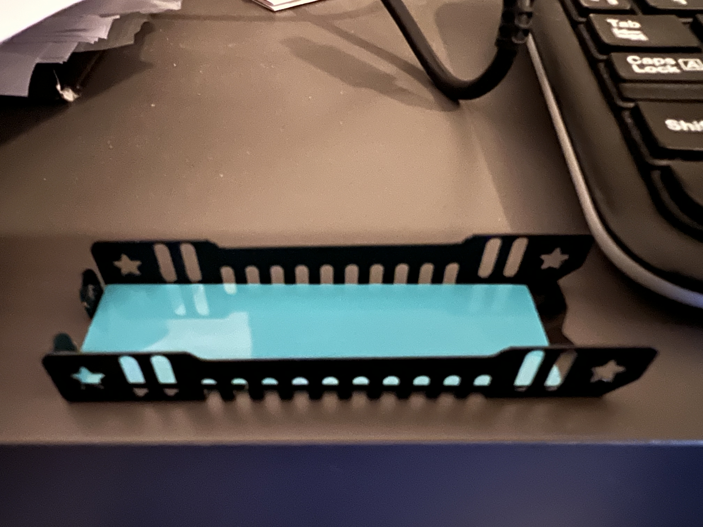
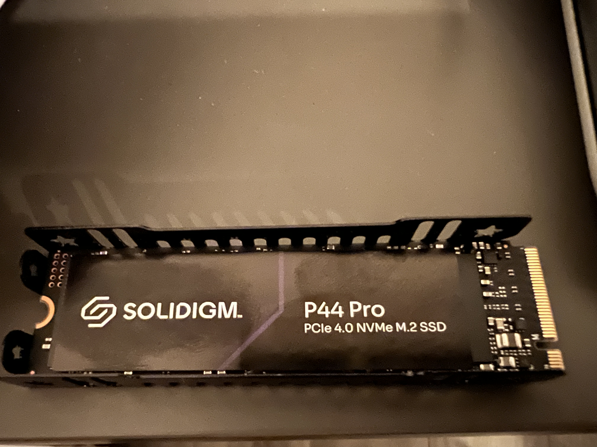
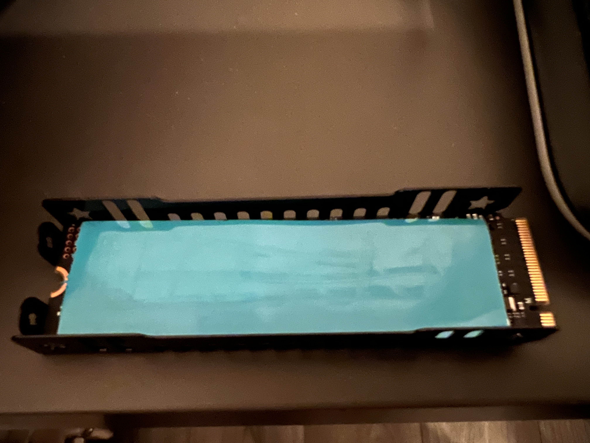
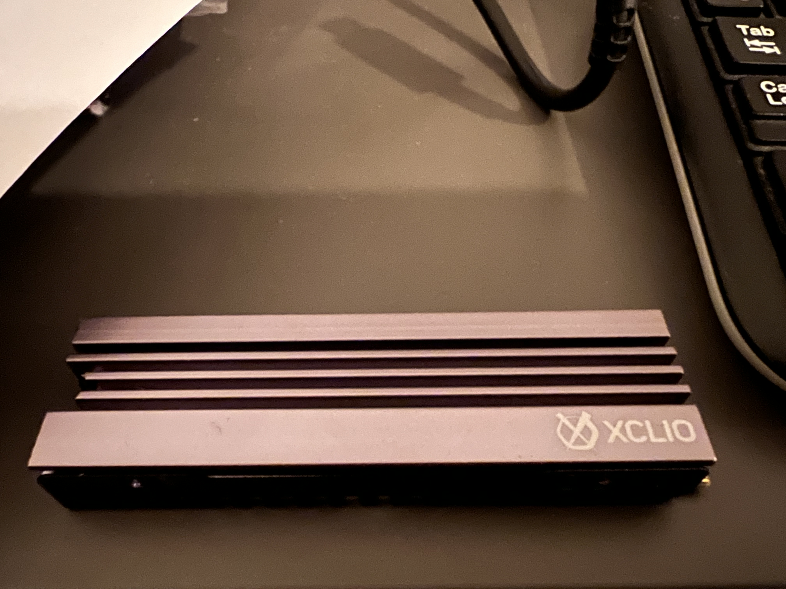
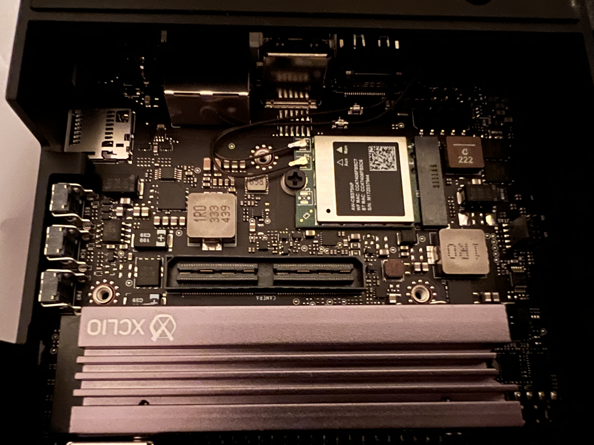

# sparkfun-nvidia-ai-innovation-challenge-2324

[SparkFun-NVIDIA-AI-Innovation-Challenge](https://www.hackster.io/contests/SparkFun-NVIDIA-AI-Innovation-Challenge) [People Tracking on Escalators](https://www.hackster.io/orgicus/escalator-people-tracker-6d00c1) code submission.

All the following guides have been developed on the following setup:

```bash
model: Jetson AGX Orin Developer Kit - Jetpack 5.1.2 [L4T 35.4.1]
NV Power Mode[3]: MODE_50W
Serial Number: [XXX Show with: jetson_release -s XXX]
Hardware:
 - P-Number: p3701-0005
 - Module: NVIDIA Jetson AGX Orin (64GB ram)
Platform:
 - Distribution: Ubuntu 20.04 focal
 - Release: 5.10.120-tegra
jtop:
 - Version: 4.2.6
 - Service: Inactive
Libraries:
 - CUDA: 11.4.315
 - cuDNN: 8.6.0.166
 - TensorRT: 8.5.2.2
 - VPI: 2.3.9
 - Vulkan: 1.3.204
 - OpenCV: 4.5.4 - with CUDA: NO
 ```

This repo is mainly aimed as a set of independent guides to novice/intermediate developers:
- how to setup an M.2 drive on NVIDIA Jetson
- how to setup ZED camera realtime 3D point cloud processing on NVIDIA Jetson
- how to setup YOLOv8 on NVIDIA Jetson
- how to prototype using the NVIDIA Generative AI on NVIDIA Jetson
- how to create a custom YOLOv8 dataset using Generative AI models on NVIDIA Jetson
- showcase: tracking people on escalators to drive beautiful real-time generative graphics in retail spaces

### how to setup an M.2 drive on NVIDIA Jetson

Your M.2 drive may include a radiator plate which is recommended.

Here is a generic guide for setting up the drive:

1. place the first adhesive tape layer to the enclosure

2. place the M.2 drive on top of the adhesive layer

3. place the second adhesive layer on top of the M.2 drive

4. place the radiator on top of the second adhesive layer

5. insert the M2. drive into one of the two M.2 slots available. (making note of the end with the 
pins) then gently lower it and screw the drive in place. 

