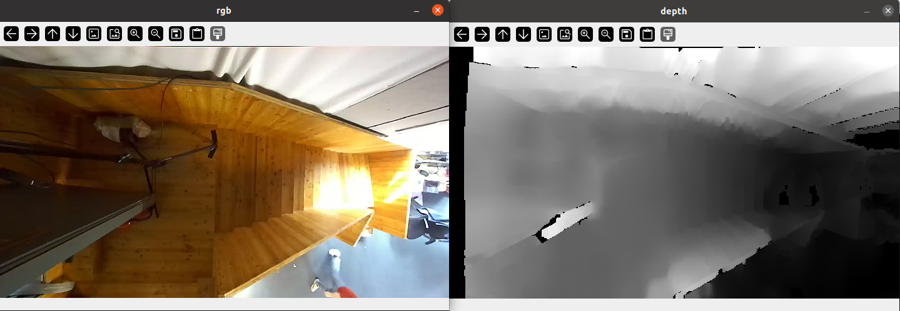

# SparkFun NVIDIA AI Innovation Challenge

[SparkFun-NVIDIA-AI-Innovation-Challenge](https://www.hackster.io/contests/SparkFun-NVIDIA-AI-Innovation-Challenge) [People Tracking on Escalators](https://www.hackster.io/orgicus/escalator-people-tracker-6d00c1) code submission.

All the following guides have been developed on the following setup:

```bash
model: Jetson AGX Orin Developer Kit - Jetpack 5.1.2 [L4T 35.4.1]
NV Power Mode[3]: MODE_50W
Serial Number: [XXX Show with: jetson_release -s XXX]
Hardware:
 - P-Number: p3701-0005
 - Module: NVIDIA Jetson AGX Orin (64GB RAM)
Platform:
 - Distribution: Ubuntu 20.04 focal
 - Release: 5.10.120-tegra
jtop:
 - Version: 4.2.6
 - Service: Inactive
Libraries:
 - CUDA: 11.4.315
 - cuDNN: 8.6.0.166
 - TensorRT: 8.5.2.2
 - VPI: 2.3.9
 - Vulkan: 1.3.204
 - OpenCV: 4.5.4 - with CUDA: NO
 ```

This repository is mainly aimed as a set of independent guides for novice to intermediate developers.
It assumes familiarity with command line basics, Python basics, and Computer Vision basics.

The following guides are available:

1. How to set up an M.2 drive on NVIDIA Jetson
2. How to set up ZED camera Python bindings
3. How to set up ZED camera real-time 3D point cloud processing on NVIDIA Jetson (WIP)
4. How to set up CUDA-accelerated YOLOv8 on NVIDIA Jetson
5. How to prototype using the NVIDIA Generative AI on NVIDIA Jetson
6. How to create a custom YOLOv8 dataset and model using Generative AI models on NVIDIA Jetson
7. Showcase: tracking people on escalators to drive beautiful real-time generative graphics in retail spaces

## First things first

To keep things tidy, let's start by creating and activating a virtual environment first:

1. Start by creating a virtual environment: e.g. `python -m venv env_jetson` (name yours as preferred)
2. Activate the virtual environment: `source env_jetson/bin/activate`

## How to set up an M.2 drive on NVIDIA Jetson

This is optional; however, it's recommended if you would like to try the many awesome [NVIDIA Jetson Generative AI Lab](https://www.jetson-ai-lab.com/) Docker images, which can take up considerable space.

Your M.2 drive may include a radiator plate, which is recommended.

Here is a generic guide for setting up the drive:

1. Place the first adhesive tape layer on the enclosure

2. Place the M.2 drive on top of the adhesive layer

3. Place the second adhesive layer on top of the M.2 drive

4. Place the radiator on top of the second adhesive layer

5. Insert the M.2 drive into one of the two M.2 slots available (making note of the end with the pins), then gently lower it and screw the drive in place


(Don't forget to [Mount at system startup](https://askubuntu.com/questions/164926/how-to-make-partitions-mount-at-startup))

## How to set up ZED camera Python bindings

This tutorial is mostly useful for those who have a ZED camera or would like to use the ZED SDK with a pre-recorded file (.svo extension). (For those who have used other types of depth sensors, the .svo would have a rough equivalent with Kinect Studio recordings, .oni OpenNI files, Intel RealSense .bag files, etc.)

In general, when working with cameras, it's a good idea to have recordings so prototyping can happen without being blocked by access to hardware or needing to move in front of the camera often.

Remember to activate the virtual environment prior to running the installer if you don't need the pyzed module installed globally.

The latest version of the ZED SDK (at the time of this writing, 4.0) is available [here](https://www.stereolabs.com/developers/release#82af3640d775), including for Jetson:

- [ZED SDK for JetPack 5.1.2 (L4T 35.4)](https://download.stereolabs.com/zedsdk/4.0/l4t35.4/jetsons) 4.0.8 (Jetson Xavier, Orin AGX/NX/Nano, CUDA 11.4)
- [ZED SDK for JetPack 5.1.1 (L4T 35.3)](https://download.stereolabs.com/zedsdk/4.0/l4t35.3/jetsons) 4.0.8 (Jetson Xavier, Orin AGX/NX/Nano, CUDA 11.4)
- [ZED SDK for JetPack 5.1 (L4T 35.2)](https://download.stereolabs.com/zedsdk/4.0/l4t35.2/jetsons) 4.0.8 (Jetson Xavier, Orin AGX/NX 16GB, CUDA 11.4)
- [ZED SDK for JetPack 5.0 (L4T 35.1)](https://download.stereolabs.com/zedsdk/4.0/l4t35.1/jetsons) 4.0.8 (Jetson Xavier, Orin AGX, CUDA 11.4)
- [ZED SDK for JetPack 4.6.X (L4T 32.7)](https://download.stereolabs.com/zedsdk/4.0/l4t32.7/jetsons) 4.0.8 (Jetson Nano, TX2/TX2 NX, CUDA 10.2)

To install:

1. Download the relevant .run file for your Jetson
2. Navigate to the folder containing it: e.g. `cd ~/Downloads`
3. Make the file executable: e.g. `chmod +x ZED_SDK_Tegra_L4T35.4_v4.0.8.zstd.run`
4. Run the installer: e.g. `./ZED_SDK_Tegra_L4T35.4_v4.0.8.zstd.run`
5. Verify/accept the installation paths for the required modules (e.g. ZED Hub module, AI module, samples, Python library):
    - ZED samples are very useful to get started. These can be installed on the M.2 drive to save a bit of space
    - The Python library is required for the examples to follow

To verify:
1. Notice several commands are now available, such as:
    - `ZED_Explorer` - handy for viewing ZED camera live streams and recording (.svo files)
    - `ZED_Depth_Viewer` - handy for exploring/reviewing recordings
    - `ZEDfu` - sensor fusion for 3D reconstruction (as point clouds or meshes) with .ply exporter
2. Double-check camera bindings (and list the camera(s) if any are connected via USB):
`python -c "import pyzed.sl as sl;print(f'cameras={sl.Camera.get_device_list()}')"`
3. Run a Python sample:
    ```bash
    # install OpenGL Python bindings, required once
    pip install PyOpenGL
    # temporarily access a Python sample folder
    pushd samples/depth\ sensing/depth\ sensing/python
    # run the sample
    python depth_sensing.py
    # after running the sample you can use popd to return to the previous folder to switch to a new sample
    ```


## How to set up ZED camera real-time 3D point cloud processing on NVIDIA Jetson

We looked at how to set up ZED camera on Jetson and how to test the streams.

The zed-open3d-pointcloud folder in this repository contains a few helper scripts. It also includes a short test ZED recording.
If you haven't cloned the repository yet, you can do so now to run this section.

### ZED camera wrapper

`zed_utils.py` includes a wrapper `ZED` class that makes it easy to grab frames (RGB/depth) and point cloud data.

The `ZED` constructor can open:
- A live camera, by passing the camera's serial number as a string
- A recording (.svo) file

To follow along, a short recording is available in the same folder (`rec.svo`). To run: `python zed_utils.py rec.svo`



### Setting up Open3D

[Open3D](https://www.open3d.org/) can be installed directly via `pip`; however, it will be the CPU version.

To make the most of the Jetson and its GPU capabilities, I've compiled Open3D from source with CUDA support and made it available in [releases](https://github.com/orgicus/sparkfun-nvidia-ai-innovation-challenge-2324/releases/tag/required_jetson_wheels).

To set up:
1. Download the prebuilt wheels from this repository's releases (if you haven't already): `wget https://github.com/orgicus/sparkfun-nvidia-ai-innovation-challenge-2324/releases/download/required_jetson_wheels/wheels.zip`
2. Unzip wheels.zip to the wheels folder and enter it:
```bash
mkdir wheels
unzip wheels.zip -d wheels
cd wheels
``` 
3. Install the wheels. (If you only plan to follow the YOLO part, ignore Open3D and vice versa.)
Full installation example:

```bash
pip install open3d-0.18.0+74df0a388-cp38-cp38-manylinux_2_31_aarch64.whl
```

**Important:** To avoid "cannot allocate memory in static TLS block" errors (due to unified memory layout), Open3D was compiled as a shared library which needs to be preloaded prior to running Python. (libOpen3D.so is part of the .zip): 

`e.g. LD_PRELOAD=/path/to/libOpen3D.so python`

(Optionally, you can run `export LD_PRELOAD=/path/to/libOpen3D.so` once (or set this to run at startup should you need that))

To test installation: `open3d example geometry/point_cloud_bounding_box` (after `LD_PRELOAD=/path/to/libOpen3D.so`)

### Processing point clouds with Open3D

Open3D offers many useful point cloud processing algorithms and tools.

In this tutorial, we'll look at processing point clouds from ZED camera and using [Open3D DBSCAN clustering](https://www.open3d.org/docs/latest/tutorial/Basic/pointcloud.html#DBSCAN-clustering).

In `zed-open3d-pointcloud`, you'll find `point_cloud_utils.py`, which provides a `PointCloudProcessor` class.
The most important parts it handles:
- Holds Open3D PointCloud structures for the raw and (to be) cropped point cloud
- Keeps track of a transformation matrix (as well as individual translation and Euler rotation): this can be useful when working with multiple cameras/point clouds that need to be merged into a single global coordinate space
- Wraps the `cluster_dbscan` exposing both clusters and their axis-aligned bounding boxes

Additionally, `point_cloud_zed.py` provides `ZEDPointCloudProcessor` (which extends the above with ZED specifics and more).

Converting a ZED RGB point cloud is a two-step process:
1. Extract point coordinates:
```py
"""
zed's get_data() returns a numpy array of shape (H, W, 4), dtype=np.float32
o3d expects a numpy array of shape (H*W,3), dtype=np.float64

[...,:3] returns a view of the data without the last component (e.g. (H, W, 3))
nan_to_num cleans up the data: replaces nan values (copy=False means in place)
"""
zed_xyzrgba = self.zed.point_cloud_np
zed_xyz = zed_xyzrgba[..., :3]
points_xyz = np.nan_to_num(zed_xyz, copy=False, nan=-1.0).reshape(self.num_pts, 3).astype(np.float64)
self.point_cloud_o3d.points = o3d.utility.Vector3dVector(points_xyz)  
```
2. Extract RGB data:
```py
"""
zed's 4 channel contains RGBA information (4 bytes [r,g,b,a]) encoded as a single 32-bit float
1. we flatten zed's 2D 4CH numpy array to a 1D 4CH numpy array: `zed_xyzrgba.reshape(self.num_pts, 4)`
2. we grab the last channel (RGBA at index 3) `[:, 3]`
3. we convert nan to zeros (`np.nan_to_num` with default args), with copy=True (to keep the array C-contiguous)
4. we use `np.frombuffer` to convert each float32 to 4 bytes (np.uint8) which we reshape from flat [r0,g0,b0,a0,...] to [[r0,g0,b0,a0],...]
5. we grab the first 3 channels: r,g,b and ignore alpha
6. finally we convert to o3d's point cloud colour format shape=(num_pixels, 3), dtype=np.float64 by casting and dividing
"""

zed_rgba = np.nan_to_num(zed_xyzrgba.reshape(self.num_pts, 4)[:, 3], copy=True)
rgba_bytes = np.frombuffer(zed_rgba, dtype=np.uint8).reshape(self.num_pts, 4)
points_rgb = rgba_bytes[..., :3].astype(np.float64) / 255.0
self.point_cloud_o3d.colors = o3d.utility.Vector3dVector(points_rgb)
```

Passing the .svo recording to the script will run a basic demo rendering a bounding box around a person clustered from the cropped point cloud inside a box.

`python point_cloud_zed.py rec.svo` will run a short demo.

On the powerful Jetson Orin AGX (with OpenCV previews closed), the demo can run around 50-60 fps!


 
(One might ask: if this works, why the need for an ML model (generative or otherwise)?
In this specific scenario, due to the 10x10m LED wall content changes, computing the depth map (and point cloud) can lead to unexpected results.
For example, the LED wall appears to bend towards a person when they are close to the wall, which results in false positives when processing the cropped point cloud:

https://github.com/orgicus/sparkfun-nvidia-ai-innovation-challenge-2324/assets/189031/47688626-7c62-46ba-8b32-77544d6e1ed8

Training a model of a person (regardless of LED wall content/etc.) is a more flexible approach which captures this edge case.)

## How to set up CUDA-accelerated YOLOv8 on NVIDIA Jetson

Jetson-compatible CUDA-accelerated torch and vision wheels are required for CUDA-accelerated YOLO (otherwise the CPU version of torch will be installed even if [`torch-2.0.0+nv23.05-cp38-cp38-linux_aarch64.whl`](https://docs.nvidia.com/deeplearning/frameworks/install-pytorch-jetson-platform/) or similar is installed). To save time and ease setup, I have compiled torch and vision from source, and the prebuilt wheels are available in this [repository's releases](https://github.com/orgicus/sparkfun-nvidia-ai-innovation-challenge-2324/releases).

1. Download the prebuilt wheels from this repository's releases (if you haven't already): `wget https://github.com/orgicus/sparkfun-nvidia-ai-innovation-challenge-2324/releases/download/required_jetson_wheels/wheels.zip`
2. Unzip wheels.zip to the wheels folder and enter it:
```bash
mkdir wheels
unzip wheels.zip -d wheels
cd wheels
``` 
3. Install the wheels. (If you only plan to follow the YOLO part, ignore Open3D and vice versa.)
Full installation example:

```bash
pip install torch/torch-2.0.1-cp38-cp38-linux_aarch64.whl
pip install vision/torchvision-0.15.2a0+fa99a53-cp38-cp38-linux_aarch64.whl
```

**Note:** 
torchvision 0.15 is _not_ the latest version of torchvision; however, it is the one [compatible](https://github.com/pytorch/vision#installation) with torch 2.0.

Now you can simply run `pip install ultralytics` and use the excellent documentation on how to:
- [predict](https://docs.ultralytics.com/modes/predict/)
- [train](https://docs.ultralytics.com/modes/train/)
- [track](https://docs.ultralytics.com/modes/track/)

Optionally, you can also follow the [ZED SDK Object Detection Custom Detector YOLOv8 guide](https://github.com/stereolabs/zed-sdk/tree/master/object%20detection/custom%20detector/python/pytorch_yolov8).


## How to prototype using the NVIDIA Generative AI models on NVIDIA Jetson

[Dusty Franklin](https://github.com/dusty-nv) has provided awesome step-by-step guides on installing each one.

We're going to look at [Vision Transformers](https://www.jetson-ai-lab.com/vit/index.html).

For example, if you follow the [EfficientViT](https://www.jetson-ai-lab.com/vit/tutorial_efficientvit.html) guide, it should be possible to infer from a video (live or pre-recorded).

**Strobe warning**: segmentation colour changes per element per frame, which can appear as strobing.

https://github.com/orgicus/sparkfun-nvidia-ai-innovation-challenge-2324/assets/189031/95cb26b5-5bb3-426e-a098-03fb5c69f283

A better idea is to use the [TAM](https://www.jetson-ai-lab.com/vit/tutorial_tam.html) model.
It allows clicking on a part of an image to segment, then track.


Here are a few examples adding a track/mask per person:

https://github.com/orgicus/sparkfun-nvidia-ai-innovation-challenge-2324/assets/189031/d4988a94-6525-4f43-8dff-f089b680b66d

https://github.com/orgicus/sparkfun-nvidia-ai-innovation-challenge-2324/assets/189031/656a8ec0-a297-413c-a61d-4bbd817179e2

https://github.com/orgicus/sparkfun-nvidia-ai-innovation-challenge-2324/assets/189031/900bb7e6-b9f2-4729-adc5-f524e978ac99

## How to create a custom YOLOv8 dataset using Generative AI models on NVIDIA Jetson

It's amazing these run on such small form factor hardware; however, the slow frame rate and reliance on initial user input isn't ideal for a responsive installation.

The technique can still be very useful for saving videos of masks as binary images (black background / white foreground), which can act as either a segmentation dataset or, using basic OpenCV techniques, a less resource-intensive object detection dataset.

Here's an example script:

```python
# import libraries
import os
import cv2
import numpy as np
import argparse
# set up args parser
parser = argparse.ArgumentParser()
parser.add_argument("-u","--unmasked_path", required=True, help="path to unmasked sequence first frame, e.g. /path/to/svo_export/frame000000.png")
parser.add_argument("-m","--masked_path", required=True, help="path to masked sequence first frame")
parser.add_argument("-o","--output_path", required=True, help="path to output folder")
args = parser.parse_args()

parent_folder_name = args.unmasked_path.split(os.path.sep)[-2].split('.')[0]
# prepare YOLOv8 format images and labels folder
img_path = os.path.join(args.output_path, "images")
lbl_path = os.path.join(args.output_path, "labels")
# check folders exist, if not make them
if not os.path.exists(args.output_path):
    os.mkdir(args.output_path)
if not os.path.exists(img_path):
    os.mkdir(img_path)
if not os.path.exists(lbl_path):
    os.mkdir(lbl_path)
    
# create video captures
cap_unmasked = cv2.VideoCapture(args.unmasked_path, cv2.CAP_IMAGES)
cap_masked   = cv2.VideoCapture(args.masked_path  , cv2.CAP_IMAGES)

kernel = np.ones((5,5),np.uint8)

img_w = None
img_h = None

while True:
    read_unmasked, frame_unmasked = cap_unmasked.read()
    read_masked, frame_masked = cap_masked.read()
    if read_masked and read_unmasked:
        # wait for valid frames first
        if img_w is None and img_h is None:
            img_h, img_w, _ = frame_masked.shape
        # in some cases basic threshold will do, in others thresholding by saturation (e.g. segmentation visualisation colours (using cv2.inRange)) makes more sense
        _, thresh = cv2.threshold(frame_masked[:,:,0] * 10, 30, 255, cv2.THRESH_BINARY)
        # morphological filters to clean up binary threshold
        thresh = cv2.dilate(thresh, kernel, iterations = 1)
        thresh = cv2.erode(thresh, kernel, iterations = 1)
        thresh = cv2.morphologyEx(thresh, cv2.MORPH_OPEN, kernel)
        # get external contours
        contours, hierarchy = cv2.findContours(thresh, cv2.RETR_EXTERNAL, cv2.CHAIN_APPROX_SIMPLE)
        label_txt = ""
        for cnt in contours:
            # get bounding box
            x, y, w, h = cv2.boundingRect(cnt)
            # write label in YOLO format
            # [object-class-id] [centre-x] [centre-y] [width] [height] -> cx, cy, w, h are normalised to image dimensions
            label_txt += f"0 {(x + w // 2) / img_w} {(y + h // 2) / img_h} {w / img_w} {h / img_h}\n"
            # preview bounding box
            cv2.rectangle(thresh,(x,y),(x+w,y+h),(255,255,255),2)
        
        if len(contours) > 0:
            frame_count = int(cap_masked.get(cv2.CAP_PROP_POS_FRAMES))
            cv2.imwrite(os.path.join(img_path, f"{parent_folder_name}_{frame_count:06d}.jpg"), frame_unmasked)
            with open(os.path.join(lbl_path, f"{parent_folder_name}_{frame_count:06d}.txt"), "w") as f:
                f.write(label_txt)

        cv2.imshow("masked", thresh)
        cv2.imshow("unmasked", frame_unmasked)
    else:
        print('last frame')
        break

    key = cv2.waitKey(10)
    if key == 27:
        break
```

It expects three paths:

1. `-u` - the path to the unmasked sequence first frame (original RGB sequence)
2. `-m` - the path to the masked sequence first frame (binary mask sequence (TAM processed output))
3. `-o` - the path to the output folder

To easily follow along with the tutorial, such a converted dataset of 15K+ images (with augmentation) is [available on Roboflow](https://universe.roboflow.com/gpyolov8tests/people-escalators-left/dataset/2).

You can now download the dataset as a YOLOv8 model and start training.

To train, you can adjust the path to where you downloaded/unzipped the dataset to run: `yolo detect train data=path/to/people-escalators-left.v2i.yolov8\data.yaml model=yolov8x-oiv7.pt epochs=100 imgsz=640`

Alternatively, you can grab [a pretrained model](https://github.com/orgicus/sparkfun-nvidia-ai-innovation-challenge-2324/releases/download/yolov8_people_detector/yolov8x-oiv7-escalators-people-detector.pt) on the above dataset from releases.

Feel free to experiment with other lighter YOLOv8 base models (e.g. yolov8s, yolov8n).

While yolov8x-oiv7 is heavier, it can still achieve 15-30fps.

Here you can see the model performing on a test set video and a new video from a new camera:

https://github.com/orgicus/sparkfun-nvidia-ai-innovation-challenge-2324/assets/189031/27705248-5ef3-4d83-8b7d-93b595fe6f6a

https://github.com/orgicus/sparkfun-nvidia-ai-innovation-challenge-2324/assets/189031/437d556a-7847-4fbd-98e5-97e5f924ba79

The above is using [YOLOv8 tracking](https://docs.ultralytics.com/modes/track/):
```bash
yolo track model=/path/to/yolov8x-oiv7-escalators-people-detector.pt source=/path/to/video.mp4 conf=0.8 iou=0.5 imgsz=320 show
```

Where the `conf` and `iou` thresholds need to be adjusted depending on the source.

In some cases, it might be worth masking out areas where it's unlikely people would walk through.
(e.g. in the case of escalators, anything outside of escalators would ideally be ignored).

(For more details, also check out [Learn OpenCV YOLOv8 Object Tracking and Counting with OpenCV](https://learnopencv.com/yolov8-object-tracking-and-counting-with-opencv))

## Showcase: tracking people on escalators to drive beautiful real-time generative graphics in retail spaces

There is a larger commercial project called Infinite Dreams. 
The full project uses 4 ZED cameras and an RTX GPU. 
I contributed the Computer Vision consulting whilst [variable.io](https://variable.io/) wrote beautiful custom generative graphics and simulations.
The position of people on escalators tracked by ZED cameras acts as an input into the cloth simulation driving the real-time graphics/simulation.

The above is a tutorial/guide using NVIDIA Jetson and a single ZED camera.
It demonstrates that it's perfectly feasible to run the project on such a device (making better use of space and especially energy).

Thank you Daniel, Martin, Joanne, Adam, Ed and the full team at [Hirsch & Mann](https://hirschandmann.com/) for the opportunity.

Thank you Marcin and Damien for your patience and for making such beautiful work.

Here is a brief making of:

[](https://player.vimeo.com/video/877084121)

Full project credits:

[variable.io](https://variable.io/h-and-m-infinite-dreams/) - generative artwork

    Marcin Ignac: design and generative art
    Damien Seguin: software lead

[Hirsch & Mann](https://www.hirschandmann.com/portfolio_page/handm-generative-artwork/) - commission

    Daniel Hirschman: strategy and direction
    Joanne Harik: concept & experience design, content production
    George Profenza: camera tracking

Hardware:

    Leyard LED Technology
    LED TEK LED Installation

Documentation:

    Jonathan Taylor / Cloud9 Photography


## Competition-specific notes:

Judging criteria:

- **Project Documentation**
    The above shows how the project was developed; it includes images, screenshots, and/or a video demonstration of the solution working as intended. While
    there are sections that may need intermediate knowledge, a beginner should be able to complete at least one of the 6 tutorials presented (making use of available scripts, an open-sourced 15K+ object detection dataset, pretrained model, etc.)

- **Complete BOM**
    The [Hackster.io project](https://www.hackster.io/orgicus/escalator-people-tracker-6d00c1#things) includes details on the hardware, software and/or tools used.

- **Code & Contribution**
   Working code with comments is provided, as well as snippets in the README to get started/explore ideas for processing data from NVIDIA Jetson TAM.

- **Creativity**
    The project idea (tracking people on escalators to drive generative graphics in a retail environment) is not original; however, there are several creative ideas at play:
     - Using Jetson for real-time point cloud processing
     - Given the project expects real-time tracking and TAM is a heavy model, the creative approach is to use TAM as an input to automate annotation to train a lighter object detection model (YOLOv8), which can achieve faster frame rates (even with the heaviest version of the model)
     - In addition to the dataset and model, Jetson precomp
